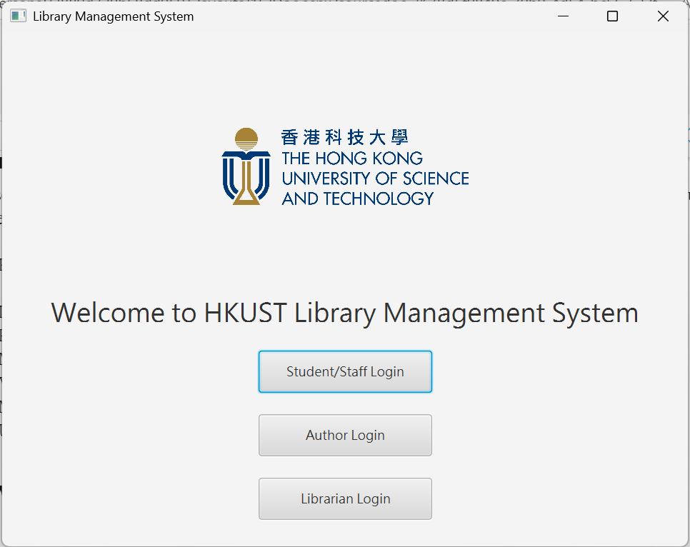

# Group Project -- Library Management System
The Library Management System is designed to provide students, staff, authors, and librarians with efficient access to and management of library services. Authors can upload and track their books within the system. Students and staff are able to borrow, read, and return books, while librarians oversee user activities and manage the library’s collection.
<br>

**Team Information**
<br>
Team ID: 20
Team Memebers: Lai Cheuk Ying, Yeung Man Yan, Cheung Hin Lung


**Project Information**
<br>
The following information is available on the Team Repo (integrated in a single document, directory: "Group20_Actvity2_Notes_Final.pdf"):
- **Section 4**: Screenshots of the execution of the application showing sample inputs and outputs
- **Section 7.1**: Report on the unit testing for the implemented tasks (100% pass)
- **Section 7.2**:Report on the coverage test (>65% branch coverage)
- **Section 2, 3, 5, 6**: Supplementary Notes
<br>

The following information is available on the Team Repo in the source code:
- **/src/main/java/library**: Documentation on the implemented tasks using JavaDoc
<br>

**Project Structure**
```plaintext
Project/
├── book/                           # Book related data
│   ├── bookcontent/               
│   │   ├── Demo Book_authorName.txt
│   │   └── ...
│   └── AllBooks.txt
├── data/                           # User related data
│   ├── borrows.txt
│   ├── notifications.txt
│   └── user_data.txt
├── src/
│   └── main/
│       ├── java/
│       │   └── library/
│       │       ├── book/           # Book data classes
│       │       ├── controllers/    # Controller classes for User Interface
│       │       ├── user/           # User data classes
│       │       ├── Main.java
│       │       └── module-info.java
│       └── resources/
│       │   ├── fxml/               # User Interface fxml file
│       │   └── img/                # Images
├── .gitignore
├── Home_Page.png
├── mvnw
├── mvnw.cmd
├── pom.xml                         # Dependencies and Plugins
└── README.md
```

- **/book**: store book list and book content
- **/data**: store user related data (i.e. user accounts, borrow records and notifications)
- **/src/main/java/library**: Java source code, includes data classes and controller classes
- **/resources**: static assets 

**Installation**
1. Clone the project

Clone or download the project from https://github.com/cherrylcy/Comp3111ProjectTeam20 and open it in IntelliJ IDEA.

2. Run the main program

Compile and run "src/main/java/library/main.java".


You will be able to see the home page of the project if you run it successfully.

